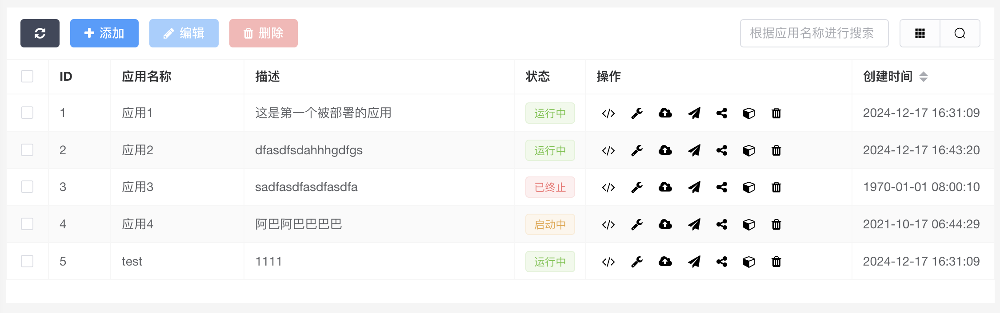

# README

> 框架基础： BuildAdmin
>
> UI 组件： **ElementPlus**
>
> 演示站：[example.kekwy.com](https://example.kekwy.com)

## Axios 配置

修改 `src/utils/axios.ts` 文件中的方法 `createAxios`，如设置转发规则、API 前缀等：

```ts
export function createAxios<Data = any, T = ApiPromise<Data>>(
    axiosConfig: AxiosRequestConfig,
    options: Options = {},
    loading: LoadingOptions = {}
): T {
    const axiosInstance = axios.create({
        baseURL: '',
        timeout: 1000 * 10,
        headers: {},
        responseType: 'json',
    });
    // TODO: 为 axios 添加自定义配置
    return axiosInstance(axiosConfig) as T;
}
```

## 页面目录

应用页和登录页的页面代码目录：

```
├─src
│  └─views
│     ├─home
│     │  ├─dashboard.vue(应用页)
│     │  ├─popupForm.vue(应用页触发编辑应用描述操作后的弹窗)
|     |  └─containerStatusDialog.vue(显示容器状态的弹窗)
│     └─login.vue(登录页)
├─...
...
```

### 登录页

替换 LOGO，将以下代码中的 `<h1>LOGO</h1><p>未创建账号</p>` 等标签的内容替换即可，如同时想替换注册界面的相关内容，请替换 `<h1>欢迎回来</h1><p>已经拥有账号</p>` 等标签的内容：

> src/views/login.vue:97

```html
<div class="toggle-box">
  <div class="toggle-panel toggel-left">
    <h1>LOGO</h1>
    <p>未创建账号</p>
    <button class="btn register-btn">注册</button>
  </div>
  <div class="toggle-panel toggel-right">
    <h1>欢迎回来</h1>
    <p>已经拥有账号</p>
    <button class="btn login-btn">登录</button>
  </div>
</div>
```

接入后端登录API（可以参考 `/src/api` 目录下的已有 API，封装登录 API）：

> src/views/login.vue:24

```ts
const login = () => {
  // TODO: 调用后端登录接口
  router.push({ path: '/home' }).catch((err) => {
    console.log(err);
  });
};
```

### 应用页

#### 替换 LOGO 和网站标题

网站标题若来自后端，请将以下 API 封装中的 url 修改为具体的后端 API：

> src/api/home/index.ts

```ts
export function getSiteConfig() {
    return createAxios({
        url: '/data/home/site-config.json',
        method: 'get',
    });
}
```

若来自本地，可以保持 API 不变，直接修改 `public/data/home/site-config.json` 文件中 `siteName` 属性的值。

替换网站 LOGO 请将 `src/layouts/home/components/logo.vue` 组件中 `img` 标签的 url 改为实际 LOGO 的 url：

> src/layouts/home/components/logo.vue:4

```html

```

#### 获取看板数据


封装 API 并调用，以从后端获取数据：

> src/views/home/dashboard.vue:101

```ts
const mockNumbers = [8, 5456, 9486, 875];

const initCountUp = () => {
  // TODO: 从后端获取数据
  for (let i = 0; i < panelsRef.value.length; i++) {
    panelsRef.value[i].number = mockNumbers[i];
  }
};
```

看板类的定义和对象的创建详见 `src/views/home/dashboard.vue:40-100`。

#### 获取应用数据



表格的主要实现详见 `src/utils/baTable.ts`。

> src/views/home/dashboard.vue:110

```ts
const baTable = new baTableClass(new baTableApi('/data/home/app/'), table);
```

创建 baTable 对象需要一个 baTableApi 对象，我们创建 baTableApi 对象时传入了一个 url 前缀，在该 API 对象中会根据这个前缀创建针对表格记录的每一个操作的 API：

```ts
this.actionUrl = new Map([
    ['index', controllerUrl + 'index'],
    ['add', controllerUrl + 'add'],
    ['edit', controllerUrl + 'edit'],
    ['del', controllerUrl + 'del'],
    ['sortable', controllerUrl + 'sortable'],
]);
```

其中 index 操作用于获取表格的所有记录数据。

表格列的定义详见 `src/views/home/dashboard.vue:110`，参考文档：[表格｜BuildAdmin](https://doc.buildadmin.com/senior/web/baTable.html)。

当前表格记录的返回格式如下，示例详见 `public/data/home/app/index.json`：

```ts
interface AppInfo {
    list: {
        id: number;
        name: string;
        desc: string;
        status: 'running' | 'stopped' | 'starting';
        create_time: number;
    }[];
}
```

#### 定义按钮与指定按钮行为

定义按钮的数据格式如下，现有按钮的定义详见 `src/components/table/index.ts:40`：

> types/table.d.ts:202

```ts
interface OptButton {
    // 渲染方式:tipButton=带tip的按钮,confirmButton=带确认框的按钮,moveButton=移动按钮,basicButton=普通按钮,dropdownButton=带下拉菜单的按钮
    render: 'tipButton' | 'confirmButton' | 'moveButton' | 'basicButton' | 'dropdownButton'
    name: string
    title?: string
    text?: string
    class?: string
    type: ButtonType
    icon: string
    popconfirm?: Partial<Mutable<PopconfirmProps>>
    disabledTip?: boolean
    // 自定义点击事件
    click?: (row: TableRow, field: TableColumn) => void
    // 按钮是否显示，请返回布尔值，比如：display: auth('add')
    display?: (row: TableRow, field: TableColumn) => boolean
    // 按钮是否禁用，请返回布尔值
    disabled?: (row: TableRow, field: TableColumn) => boolean
    // 自定义其他 el-button 的属性
    attr?: Partial<Mutable<ButtonProps>>
}
```

在定义按钮时可以通过指定 click 函数，来指定按钮的行为：

```ts
{
    render: 'tipButton',
    name: 'status',
    title: '容器状态',
    text: '',
    type: 'text',
    icon: 'fa fa-cube',
    class: 'table-opt-button',
    disabledTip: false,
    click(row, field, baTable: baTableClass) {
        // TODO: 根据 row.id 调用后端 API 获取对应应用的容器状态
        console.log(row.id);
        baTable.form.items = {
            status: '从后端获取的状态信息',
        };
        baTable.toggleForm('ViewContainerStatus');
    },
},
```

关于按钮控制弹窗显示的实现可以参考 `src/views/home/containerStatusDialog.vue` 与 `src/views/home/popupForm.vue`，并查看表格实现代码中的 toggleForm 方法。

指定下拉按钮的行为，首先定义该按钮的渲染类型为 `dropdownButton`，随后配置按钮的 `dropdownMenu` 属性：

```ts
{
    render: 'dropdownButton',
    name: 'invoke',
    title: '调用',
    text: '',
    type: 'text',
    icon: 'fa fa-paper-plane',
    class: 'table-opt-button',
    disabledTip: false,
    dropdownMenu: {
        handleCommand(command, row, field, baTable) {
            // TODO: 根据 command 进行不同方式的调用
            console.log(command);
        },
        items: [
            {
                command: 'basic',
                name: '普通调用',
            },
            {
                command: 'fast-start',
                name: '快速启动',
            },
        ],
    },
},
```

`dropdownMenu` 属性的定义如下：

```ts
interface DropdownItem {
    command?: string | number | object; // 点击下拉菜单项后，调用 handleCommand 时传入的 command 参数
    name: string; // 在下拉菜单中显示的名称
}
interface DropdownMenu {
    // 点击下拉菜单项后调用的函数
    handleCommand: (command: string | number | object, row: TableRow, field: TableColumn, baTable: baTableClass) => void;
    items: DropdownItem[];              // 下拉菜单项的定义
}
```

如果不指定按钮行为，则会调用如下方法，根据按钮名称触发默认按钮行为：

> src/utils/baTable.ts:247

```ts
onTableAction = (event: string, data: anyObj) {
  ...
}
```

